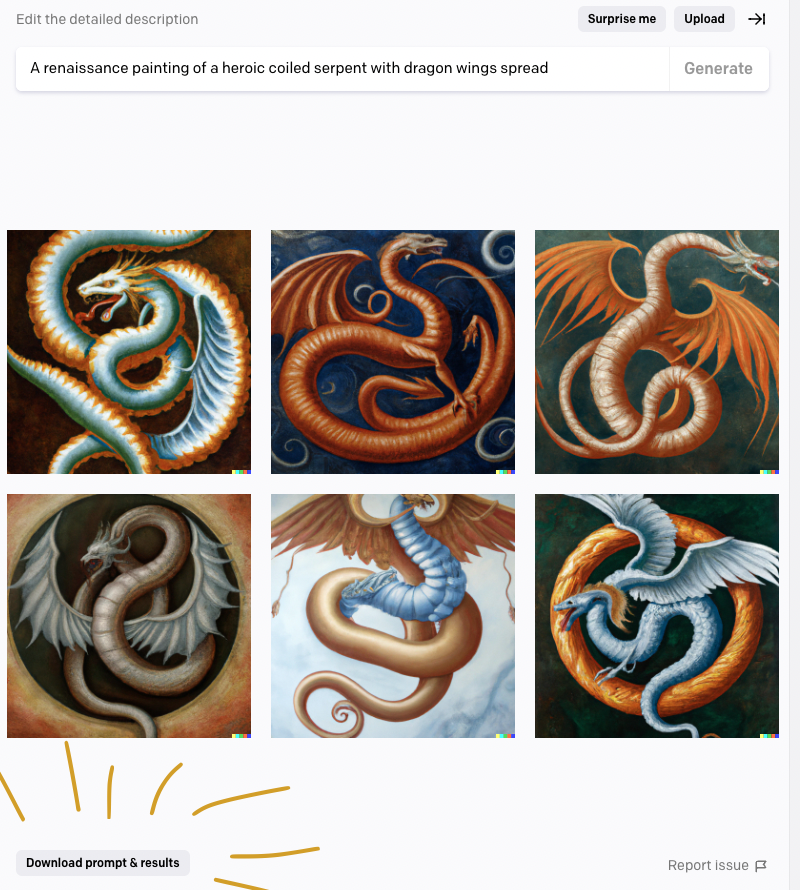

# DALL·E 2 Image Downloader

Adds a button to the DALL·E 2 web app that lets you download generated images along with the prompt that generated them.

## What does it do

When you click the button it will download a zip folder containing all the generated images for the currently viewed prompt. The filename of the zip folder will be the prompt that generated the images.

# Roadmap

- [ ] Make the button less wordy and look more like an action button
- [ ] Make a logo for the extension
- [ ] Generate icons from the logo and add to the manifest
- [ ] Allow custom naming conventions for the images in the zip file
- [ ] Set up GitHub Actions pipeline to create releases and attach release assets
- [ ] Submit to Chrome Store
- [ ] Submit to Firefox Store

# Contributions

Contributions are welcome! Please feel free to submit PRs.
