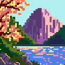

# DALL·E 2 Image Downloader

Adds a button to the DALL·E 2 web app that lets you download generated images along with the prompt that generated them.

## The problem

DALL·E 2 is an incredible achievement. It displays creativity never before seen in a ML system. But the UI only lets you view the 50 most recent prompts and generated image sets. Anything more than 50 tasks ago is lost. Currently if you want to save the images you've generated you have to download each image one by one. And if you want to remember which prompt generated these images you have to make a note of that yourself, and how to link which prompts generated which images becomes a tedious exercise in manual organisation and file renaming.

## The solution

This extension creates a button in the bottom left hand corner of the page that, when clicked, downloads all the current prompt's images in a zip folder, whose filename is the prompt that generated them. You can now save your prompt and its generated images in a single click.

## Known limitations

If the prompt's input field has been edited after generating the images or after navigating back to a previous task, the zip folder name will take that edited version of the prompt instead of the original one that was actually used to generate the images.

Unfortunately the page HTML contains no other reference to the prompt that generated the images. The page title was an option, but it doesn't update when you navigate to a previously generated prompt. So the prompt input field is the best we can do.

## How to install

Make sure you have Node installed. Then run `npm install && npm run build`.
Navigate to [`chrome://extensions`](chrome://extensions), toggle developer mode on, click `Load unpacked`, and select the newly created `dist` folder in the project folder. Once you've done this you can toggle developer mode back off. That's it!

# Roadmap

- [ ] Make the button less wordy and look more like an action button
- [x] Make a logo for the extension
- [x] Generate icons from the logo and add to the manifest
- [ ] Allow custom naming conventions for the images in the zip file
- [ ] Set up GitHub Actions pipeline to create releases and attach release assets
- [ ] Submit to Chrome Store
- [ ] Submit to Firefox Store

# Contributions

Contributions are welcome! Please feel free to submit PRs.
